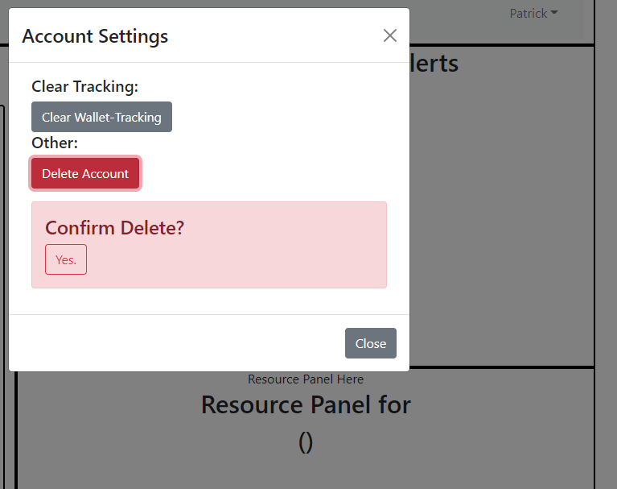
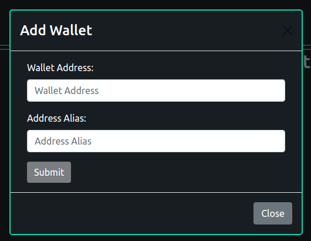

# CryptoSonar
## Team Members: 
* Joffrey Inocencio
* Kendall Smith

## Webpage:
* Hosted Front-end Application
https://crypto-sonar-ui.herokuapp.com/login

* Hosted Back-end GraphQL IDE 
https://crypto-sonar-api.herokuapp.com/graphql

## About:
CryptoSONAR is a product for tracking short-term price signals for tokens on Decentralized Exchanges (DEX) in the Decentralized Finance (DeFI) space.  This tool enables users to securely login, add and remove wallets of other traders on the Binance Smart Chain such as whales and trading bots, to provide flash price alerts for buying or selling opportunities.

This project was started with starter code from `react-create-app`.
Note: Browser preferance for GoogleChrome

## Future Scope of Work:
* Upon detection of invalid wallet, turn off API data retrieval until new wallet selected or wallet address updated
* Ability to hide a token by address if it is determined to be scam, aka not something bought but forced transfer
* Improved logic for alerts to identify the exact new transactions in a wallet for the user to review
  * Includes back-end work to setup new collections in MongoDB to store transactions for wallets
  * Add new graphql query and mutation defintions for these collections 
  * Configure front-end to query the back-end tables instead of owning the task of data retrieval in AlertPanel
* Improved user authentication that doesn't use localStorage, and instead a service like Firebase, etc.
* Further aesthetic improvements to popup alerts/modals, etc.
* User wallet integration to allow for quick buy and sell of tokens identified in the alerts panel
* Expand details available to a user about a token or transaction, such as liquidity, USD value, etc.
  * Adding USD value visibility would require: 
      * Easy to fetch token to USD conversion in real-time, but...
      * Requires frequent API querying for each token, which...
      * Would create a bad UX waiting for 100s of responses on each rerender

## Contributions made by Joffrey:
### Iteration 3
* User Features:
  * Users are able to edit a selected wallet item
* Software Development:
  * Implemented update wallet on the backend schema and on the frontend gql call
  * Addressed user login bug by refreshing the page upon user log in.
    * Unsightly refresh upon rendering the dashboard
      Fix attempt #2: Addressed user login bug by initally setting localStorage userCreds to persist starting from login component->app state->layout.
* Bells and whistles
  * Wallet Address is shown when hovering over a wallet item.
  * More admin login examples are provided on incorrect userCreds alert.
  * Logo is a clickable link landing to main dashboard page.
  * Applied CSS themes to match dex.guru

### Iteration 2
* User features:
  * Users are initially directed to `./login`
    * Chosen username is shown in the login text box upon creating new account
  * Users are able to sign-in and sign-out
    * Users are notified if entered user credentials are invalid
  * Users are able to delete individual wallets on the tracked wallets panel of their entire collection of tracked wallets in account settings
  * Users can delete account in account settings
    * Users are alerted to confirm to delete account 
  * Users are able to persist their UserCredentials accross state changes and browser refresh via user's local token storage.
    * Tokens are created/replaced upon user signin and destroyed upon user log out.
* Software Development changes:
  * Implemented Signin page and create account modal
  * Passed UserId from signin down to layout and accross child components
  * Replaced fetch/query calls with gql/apollo-client
  * Debugged rerendering issues in the tracked wallets pannel
    * addWallet child component updates sibling component listWallets by trigerring an update to the Wallet pannel parent state
  * Connected delete all wallets and deleteUser in account settings in UI via fetch calls to backend operations

### Iteration 1
* Front-end Development
  * Containerizing initial page design skeleton
  * Implementing Third-Party Libaries
    * React-Bootstrap
  * Nav Panel
    * Account Settings Modal
  * Tracked Wallets Pannel
    * Modal for Add wallet form
    * Display tracked wallets
    * Rerender newly added wallet onto the walletList
* Connecting Front-end to Back-end with API calls
  * Fetch tracked wallets from graphql server
  * Add wallet form  
* Deploying Front-end to Heroku
  * Added `"serve": "^12.0.0"` dependancy necessary for deployment to Heroku

## Contributions made by Kendall:
### Iteration 3
* Front-end Development
  * User Features
    * Logic in AlertItems shown in AlertsPanel to indicate if transaction was a buy or sell
    * Alert for when new transaction(s) for a tracked wallet are identified
    * Alert for when a wallet has invalid address, BscScan.com API response is not OK
    * Transactions shown in AlertPanel are updated with a timeout feature
    * Added modal to confirm if user wants to delete a wallet
  * UI Improvements
    * Updated AlertItem aesthetics
      * Token name (link to token contract) is a button with hover
      * Token quantity field has formated numbers with commas
      * Buy and Sell indicators have unique styling
      * Link to transaction is a bootstrap icon
      * Transaction timestamp converted to UTC to align with Dex.guru PriceChart
      * Override of bootstrap icon CSS styling for buttons to add, delete and update a wallet
      * Override of default modal CSS styling for add, delete and update wallet features

### Iteration 2
* Front-end development
  * Refactored Bscscan API utility into AlertPanel when receives wallet from Layout props
  * Designed Alert Panel nested component structure
    * AlertPanel fetches transaction data based on selected wallelets
    * AlertTable builds a React Table of AlertItems (rows)
    * AlertItem individual row element displaying transaction properties and links
  * Panel/Modal to contain embedded Iframe for PriceChart
    * Shows price chart for a token from a selected transaction/alert row
    * Embedded price chart comes from dex.guru website (DApp)
  * Implemented error handling for when invalid address is supplied by user
    * Based on Response message status OK from external API service
  * Debugged Heroku issue with users initially directed to `./login`
    * Package.json homepage requires the full path: `https://crypto-sonar-ui.herokuapp.com/login`
* Back-end Development
  * Created userLogin root query definition 
    * Support checking new user exists in login process
* Deployed fixes and updates to Heroku
  * Added `"react-iframe": "^1.8.0"` to support embedding of PriceChart Iframe
	* Added	`"react-loader-spinner": "^4.0.0"` to add animated loading icon while fetching Bsc data

### Iteration 1
* Back-end Development
  * Deployed MongoDB database to Atlas cluster
  * Designed GraphQL Schema
    * User type
    * Wallet type
    * Query types
    * Mutation types
  * Built query definitions for API requests
    * Add and remove user mutations
    * Add and remove wallet mutations
    * Query all wallets by associated userId
  * Setup Express server to host GraphQL API
  * Created scripts for database initialization (either local or deployed)
    * Drop all documents from database collections
    * Populate mock documents/data into the database
* Data Retrieval Development
  * Bitquery.io API script for token to USD conversion
  * Bscscan.com Api script for list of tokens held by wallet
* Deploying Back-end to Heroku
  * Added `"express-graphql": "^0.12.0"` dependency for stream-lining deployment of GraphQL API
  * Added `"mongoose": "^5.13.5"` dependency for simplicity in creating GraphQL schema and models

